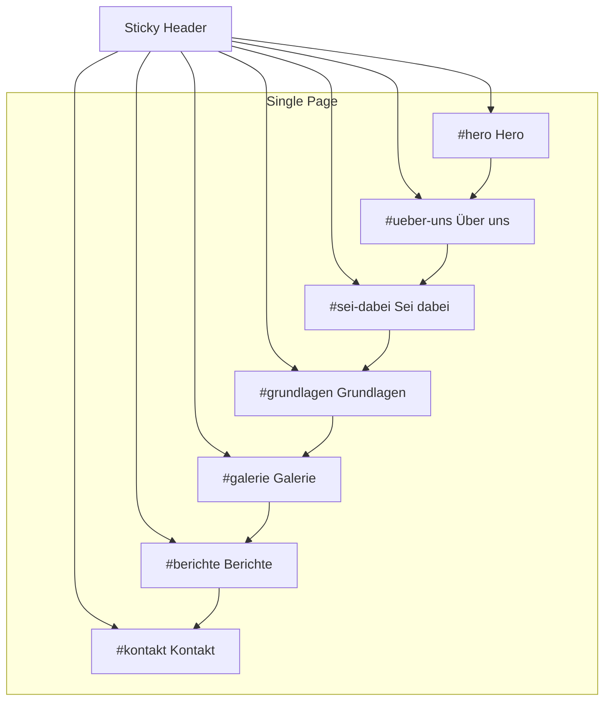

# PEC Osnabrücker Otter Homepage

## Ausgangslage

- **Projekt:** Next.js 16 mit Tailwind CSS 4 ([app/page.tsx](app/page.tsx), [app/layout.tsx](app/layout.tsx))
- **Referenz:** [pfadfinder-butzbach.de](https://pfadfinder-butzbach.de/) – klare Struktur mit Header, Hero, Sektionen, Footer
- **Ziel:** Weiße Homepage mit Menü, Scrollfunktion und Inhalten zu Pfadfinderarbeit in Osnabrück

## Struktur der Referenzseite (Butzbach)

- **Header:** Logo, Navigation (Über uns, Sei dabei!, Grundlagen, Galerie, Berichte, Dokumente, Kontakt, Schutzkonzept)
- **Hero:** Titel, Untertitel, CTA-Button
- **Sektionen:** Über uns, Sei dabei!, Aus dem Pfadfinder-Alltag (Berichte/Galerie)
- **Footer:** Copyright, Impressum, Datenschutz, Kinderschutzkonzept

## Geplante Implementierung

### 1. Layout und Navigation

- **Sticky Header** mit Logo und horizontaler Navigation
- **Menüpunkte:** Über uns, Sei dabei!, Grundlagen (Leitbild, Kindesschutz), Galerie, Berichte, Kontakt
- **Smooth Scroll** zu Anker-Sektionen auf der gleichen Seite (Single-Page mit Ankern)

### 2. Seitenstruktur (Single-Page mit Ankern)

| Sektion    | ID            | Inhalt                            |
| ---------- | ------------- | --------------------------------- |
| Hero       | `#hero`       | Willkommenstext, Stamm 0904, CTA  |
| Über uns   | `#ueber-uns`  | Vorstellung PEC Osnabrücker Otter |
| Sei dabei! | `#sei-dabei`  | Einladung, Treffzeiten, Kontakt   |
| Grundlagen | `#grundlagen` | Leitbild, Kindesschutz            |
| Galerie    | `#galerie`    | Platzhalter für Bilder            |
| Berichte   | `#berichte`   | Platzhalter für Berichte          |
| Kontakt    | `#kontakt`    | Adresse, Kontaktmöglichkeiten     |

### 3. Design (weiß, klar)

- **Hintergrund:** Weiß (`#ffffff`)
- **Text:** Dunkelgrau/Schwarz für gute Lesbarkeit
- **Akzentfarbe:** Dezentes Grün oder Blau (Pfadfinder-/Naturthema)
- **Typografie:** Geist Sans (bereits im Projekt)
- **Responsiv:** Mobile-first, Hamburger-Menü auf kleinen Bildschirmen

### 4. Dateien

- **[app/page.tsx](app/page.tsx):** Komplette Homepage mit allen Sektionen
- **[app/layout.tsx](app/layout.tsx):** Metadata anpassen (Titel: "PEC Osnabrücker Otter - Stamm 0904")
- **[app/globals.css](app/globals.css):** Dark Mode entfernen/anpassen, damit die Seite dauerhaft weiß bleibt
- **Optional:** `components/Header.tsx`, `components/Footer.tsx` für bessere Wiederverwendbarkeit

### 5. Inhalte (Platzhalter)

Texte werden als Platzhalter für die Osnabrücker Otter eingefügt, z.B.:

- **Hero:** "PEC - Pfadfinder Osnabrücker Otter" / "Stamm 0904"
- **Über uns:** Kurzvorstellung analog zu Butzbach (PEC, Treffen, Altersspanne)
- **Sei dabei!:** Einladung, Hinweis auf Treffzeiten
- **Kontakt:** Platzhalter für Adresse/Kontakt

### 6. Technische Details

- **Scroll-Verhalten:** `scroll-behavior: smooth` in CSS
- **Navigation:** `<a href="#ueber-uns">` etc.
- **Mobile Navigation:** Einfaches Hamburger-Menü mit Zustand (useState) oder CSS-only

## Abweichungen von der Referenz

- **Single-Page statt Multi-Page:** Alle Sektionen auf einer Seite mit Anker-Navigation (einfacher zu starten)
- **Sprache:** Deutsch (wie Referenz)
- **Kein CMS:** Statische Inhalte in den Komponenten

## Offene Punkte

- **Bilder/Logo:** Soll ein Logo oder Otter-Bild eingebunden werden? (aktuell Platzhalter)
- **Echte Kontaktdaten:** Adresse, E-Mail, Telefon – als Platzhalter oder schon konkret?
- **Galerie/Berichte:** Nur Platzhalter-Sektionen oder erste Beispielinhalte?

